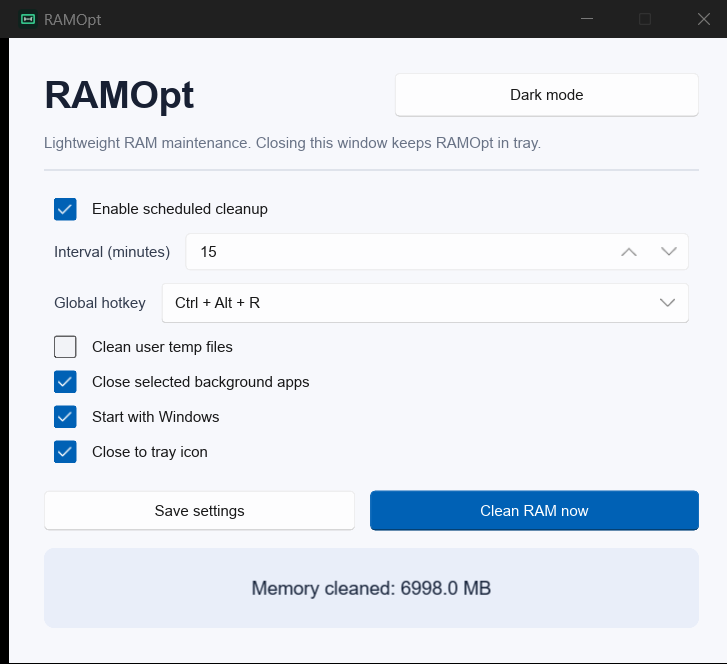

# RAMOpt

RAMOpt is native Windows app for reducing memory pressure. Written in Rust with Slint. No browser runtime or WebView.

## What it does

RAMOpt requests Windows to:

- Empty RAMOpt's own working set.
- Trim working sets for accessible user processes.
- Run cleanup manually, on schedule, or with global hotkey.
- Optionally remove files from `%TEMP%` and `C:\Windows\Temp`.
- Optionally trim background apps.

It also provides notification-tray controls, optional Windows startup, configurable interval, and default `Ctrl+Alt+R` hotkey.

## App interface and usage



1. Keep **Enable scheduled cleanup** enabled to run RAM cleanup at configured interval. Set **Interval (minutes)** from 1 to 1440.
2. Select global hotkey. Default **Ctrl + Alt + R** runs cleanup while RAMOpt is open or minimized to tray.
3. Enable **Clean user temp files** to remove files from current user's `%TEMP%` directory during cleanup.
4. Enable **Close selected background apps** only when those apps are safe to close. RAMOpt trims accessible user-process working sets either way.
5. Enable **Start with Windows** to launch RAMOpt after sign-in. Enable **Close to tray icon** to keep it running when main window closes.
6. Click **Save settings** after changing options. Click **Clean RAM now** for immediate cleanup. Status panel reports result.
7. Use **Dark mode** button to switch color scheme. Tray menu provides restore, cleanup, and exit controls.

## What it does not do

- Does not overclock RAM or create physical memory.
- Does not disable, stop, configure, or modify Windows Update.
- Does not force protected processes to release memory.

Windows decides when reclaimed memory becomes available. Free RAM may not rise immediately because Windows uses standby cache to improve performance.

## Requirements

- Windows 10 or Windows 11.
- [Rust toolchain](https://www.rust-lang.org/tools/install) with MSVC target.
- Visual Studio Build Tools with **Desktop development with C++** workload, if Rust setup did not install MSVC linker.
- PowerShell, included with Windows.

## Build from source

1. Clone repository:

   ```powershell
   git clone https://github.com/thnonl/RAMOpt.git
   cd RAMOpt
   ```

2. Confirm Rust installation:

   ```powershell
   rustc --version
   cargo --version
   ```

3. Build optimized executable:

   ```powershell
   cargo build --release
   ```

4. Run app:

   ```powershell
   .\target\release\ramopt.exe
   ```

Output: `target\release\ramopt.exe`.

## Create release package locally

Run:

```powershell
.\package-release.ps1
```

Script builds release binary, then creates `release\RAMOpt\` containing:

- `RAMOpt.exe`
- `LICENSE`
- `README.md`

## GitHub releases

Push version tag to create GitHub Release automatically. Workflow builds `RAMOpt.exe`, packages files as `RAMOpt-Windows-x64.zip`, uploads zip to release page, and stores raw executable as workflow artifact.

```powershell
git tag v0.1.0
git push origin v0.1.0
```

Can also run **Actions → Release → Run workflow**, then enter release tag such as `v0.1.0`.

## Notes

- Some protected processes cannot be trimmed without elevated privileges. RAMOpt skips them.
- Startup toggle writes `HKCU\Software\Microsoft\Windows\CurrentVersion\Run\RAMOpt`.
- Settings stored at `%APPDATA%\RAMOpt\settings.json`.
