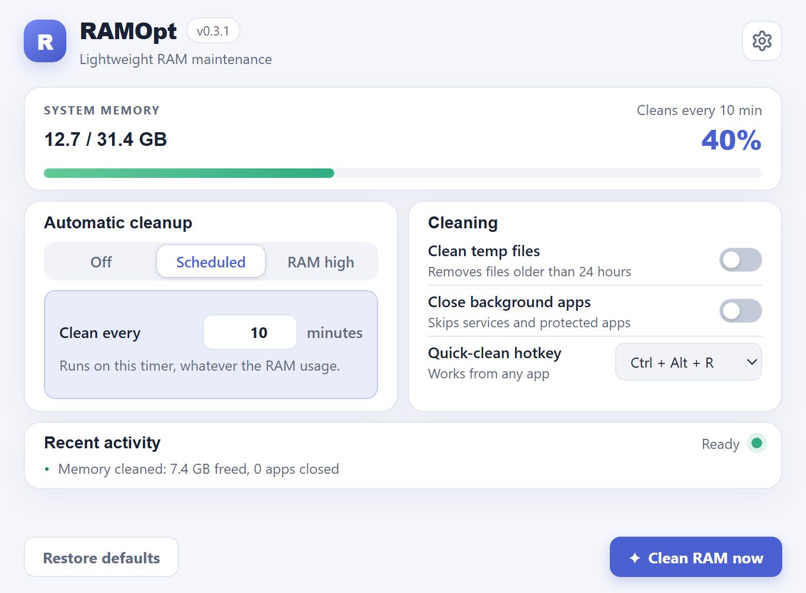
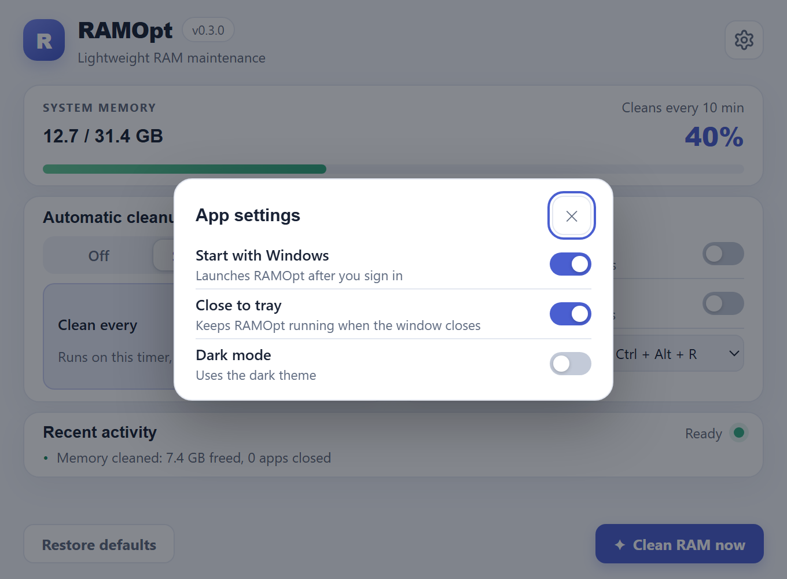

# RAMOpt

## Download and run

[Download latest release](https://github.com/thnonl/RAMOpt/releases)

1. Open link above and download RAMOpt release archive from **Assets**.
2. Extract downloaded archive to folder where you want to keep app.
3. Open extracted `RAMOpt` folder and run `RAMOpt.exe`.

RAMOpt is a Windows memory-maintenance app built with Tauri v2, Rust, and a local Vite frontend. Cleanup runs at most one operation at a time.

## What it does

During cleanup, RAMOpt runs three backend optimization phases:

- **Phase 1:** measures physical memory and requests a system working-set trim; Windows may include RAMOpt and other eligible processes.
- **Phase 2:** trims system file cache, flushes modified pages, and purges the standby list.
- **Phase 3:** combines physical pages, reconciles the registry cache, and flushes modified file cache on fixed volumes.
- Each memory area runs independently; failures are logged and later areas still run.
- Optionally removes stale regular files older than 24 hours from current user's `%TEMP%`; directories and symbolic links are skipped.
- Optionally closes selected user applications gracefully and force-cleans only narrowly identified orphan helper processes. Hardware drivers, security processes, network processes, active application trees, and running service-owned processes are excluded.
- Reports estimated physical-memory delta, successful/skipped area counts, and orphan-process cleanup count. The delta is system-wide and can include normal Windows workload changes.

Cleanup runs on demand, on configured schedule, or from global hotkey. Tray menu can show the app, open App settings, run cleanup, toggle scheduled cleanup, temp cleanup, background-app cleanup, Windows startup, or exit.

## App interface and usage



1. **Automatic cleanup** offers one mode at a time: **Off**, **Scheduled** (cleans every 1–1440 minutes) or **RAM high** (checks every minute and cleans while usage is at or above the threshold, 1–100%, default 75%). Only the settings of the selected mode are shown, and the window keeps the same height in every mode.
2. **Clean temp files** removes stale files from the user temp folder and also attempts `C:\Windows\Temp`; files RAMOpt cannot access are skipped.
3. **Close background apps** is disabled by default. It sends graceful close requests to matching processes in the current user session, including OneDrive, Teams, and Adobe helper apps. It force-cleans only stale, parentless, childless, network-idle helper processes that match exact allowlisted paths and command lines. It skips active application trees, running service-owned processes, hardware drivers, security/network processes, and ambiguous processes.
4. **Quick-clean hotkey** (default **Ctrl + Alt + R**) runs a cleanup from any app while RAMOpt is running, including when it is hidden in the tray. If another program already owns the hotkey, RAMOpt reports it once and retries every 10 seconds.
5. Click the gear icon in the header, or choose **App settings…** from the tray menu, to open **App settings**: **Start with Windows**, **Close to tray** (hides the window instead of exiting) and **Dark mode**.

   

6. Click **Clean RAM now** for immediate cleanup. **Recent activity** shows the current status and the latest cleanup result. **Restore defaults** resets all settings.
7. RAMOpt checks GitHub Releases hourly. When a newer release exists, an **Update available** banner appears (the tray menu enables **Update now**). **Install update** downloads the release archive, verifies its SHA-256 checksum, replaces the app files and restarts RAMOpt.

The window has a fixed width and cannot be resized or maximized; its height adapts only when the update banner appears.

## What it does not do

- Does not overclock RAM, create physical memory, or guarantee free-RAM increase.
- Does not disable, stop, configure, or modify Windows Update.
- Does not bypass Windows protection or access controls.

Windows decides when trimmed memory becomes available. Free RAM may not rise immediately because Windows uses standby cache to improve performance. Native cache and page-list operations can increase page faults or disk I/O; RAMOpt logs each area separately and skips only the failed area.

## Requirements

- Windows 10 or Windows 11.
- RAMOpt requests administrator privileges because phases 1–3 use system memory APIs and volume cache operations. Launching RAMOpt or its Windows startup entry may show a UAC prompt.
- [Rust toolchain](https://www.rust-lang.org/tools/install) with MSVC target.
- Node.js and npm for the Vite frontend.
- Microsoft WebView2 Runtime (the Tauri installer can bootstrap it).
- Visual Studio Build Tools with **Desktop development with C++** workload, if Rust setup did not install MSVC linker.
- PowerShell, included with Windows.

## Build from source

1. Clone repository:

   ```powershell
   git clone https://github.com/thnonl/RAMOpt.git
   cd RAMOpt
   ```

2. Confirm Rust installation:

   ```powershell
   rustc --version
   cargo --version
   ```

3. Install frontend dependencies and run the Tauri application:

   ```powershell
   npm install
   npm run tauri dev
   ```

4. Build a release bundle:

   ```powershell
   npm run tauri build
   ```

   Tauri bundles are created under `target\release\bundle\`; executable is `target\release\ramopt-tauri.exe`. `package-release.ps1` runs the Tauri build, stages the app as `RAMOpt.exe` with updater, license and README, then writes `release\RAMOpt-Windows-x64.zip` and `release\SHA256SUMS.txt`. Pushing a `vX.Y.Z` tag runs the same script in GitHub Actions and publishes the release.

## Notes

- RAMOpt allows one running instance. Starting it again restores the existing window.
- Some protected processes cannot be trimmed even with elevated privileges. RAMOpt skips failed areas/processes and records native error codes in `%LOCALAPPDATA%\RAMOpt\ramopt.log`.
- Startup toggle uses the Tauri autostart plugin. The application manifest requests Administrator privileges, so Windows may show UAC at launch and startup.
- Settings and `ramopt.log` are stored in `%LOCALAPPDATA%\RAMOpt`. An existing `settings.json` beside `RAMOpt.exe` is migrated on first launch.
- The native working-set operation is system-wide; Windows may include RAMOpt and other eligible processes. RAMOpt does not explicitly open or target its own process.
- `OneDrive.Sync.Service.exe` is eligible only under strict orphan checks: exact OneDrive path, current user session, no running OneDrive companion, no parent or child, and no service ownership. Otherwise it is skipped.
- The updater verifies a `SHA256SUMS.txt` checksum before replacing files, and restarts the previous install if the update fails.
